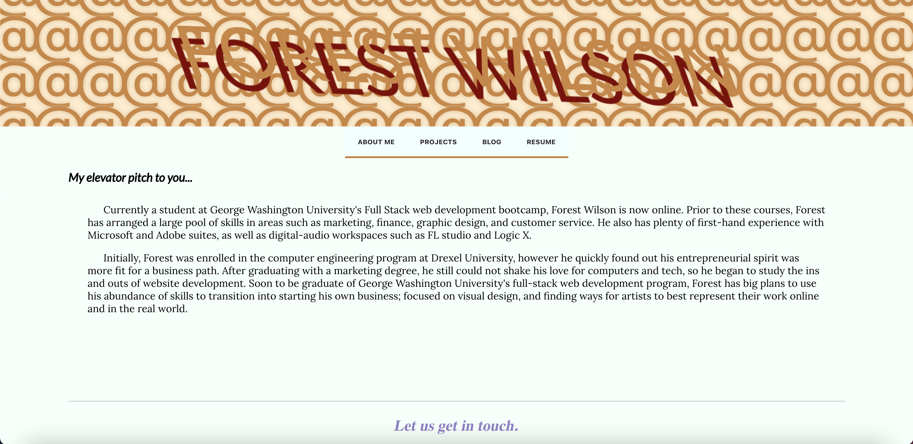
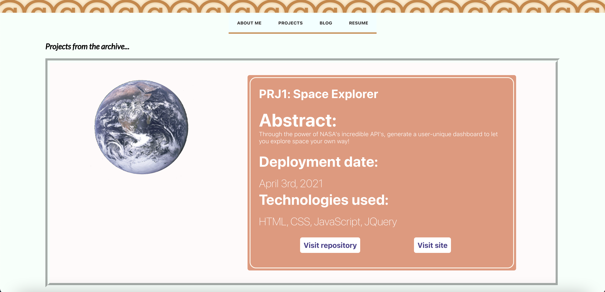
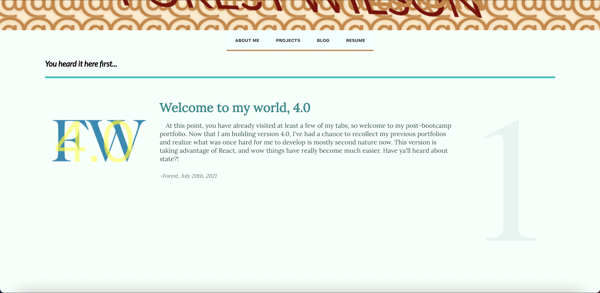
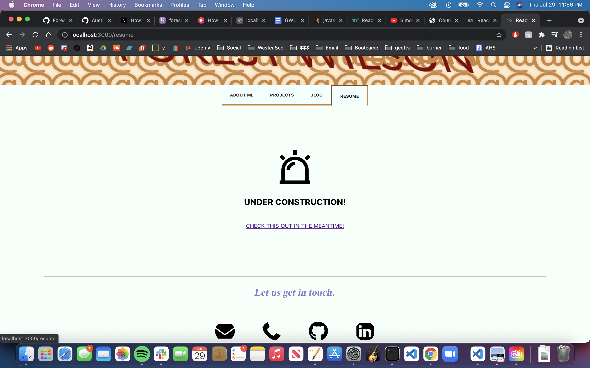

# Forest Wilson - React Portfolio
MIT - (https://opensource.org/licenses/MIT) - For Good.
<!-- Original deployment date: July 23st, 2021 -->

## Table of Contents:
- [Tech used](#tech-used)
- [Project description](#project-description)
- [Usage instructions](#usage-instructions)
- [Project installation](#project-installation)
- [Additional comments](#additional-comments)
- [Contribution information](#contribution-information)
- [Questions](#questions-or-concerns)
- [Extras](#extras)

### About This Project

* # Tech used:
  1. JavaScript/JSX
  2. React
  3. CSS
  5. Heroku deployment
  6. Eslint

* # Project description:
  React portfolio by Forest Wilson. 

* # Usage instructions
  Use this application to learn more about me and my projects

* # Project installation
  1. Visit site link
  2. Enjoy.
     
* # Additional comments
  - will for sure be updating this constantly. my first big dive into React.js and I love it.

  - I'd like to add a blog feature to my site using a more MERN approach. (minus the E.) Also need to make this tab mobile responsive. For future deployment. EDIT: Decided to scrap the Blog idea. I like the idea of keeping track of personal projects, but I'll save this feature for a future time when I have more to share.

#### Contribution information 

- If you would like to contribute to this project, please follow best practices and message me at one of the provided contacts bellow if you want to push!

###### Questions or concerns? 
* Please contact me at one of the following!

  Email - Hexaforest@gmail.com
  gitHub - https://github.com/ForestW70/

# Extras

* Screenshots(7/23/21):
  - 
  - 
  - 
  - 

* Links:
  - [Repo page](https://github.com/ForestW70/Portfolio4.0)
  - [Live Page](https://forestwilson.herokuapp.com/)
